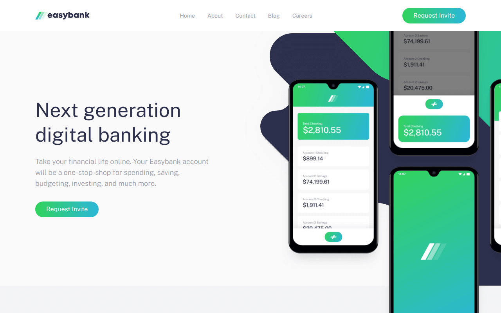

# Easybank landing page

---

## About The Project

This challenge will provide a nice test for your layout skills. If you're ready to move up from Junior challenges, this one is a great next step.

Your users should be able to:

- View the optimal layout for the site depending on their device's screen size
- See hover states for all interactive elements on the page

While doing this task, I decided to use Tailwind CSS. Performing the task, I wanted to understand how this CSS framework works.

---

## Built with

  

---
